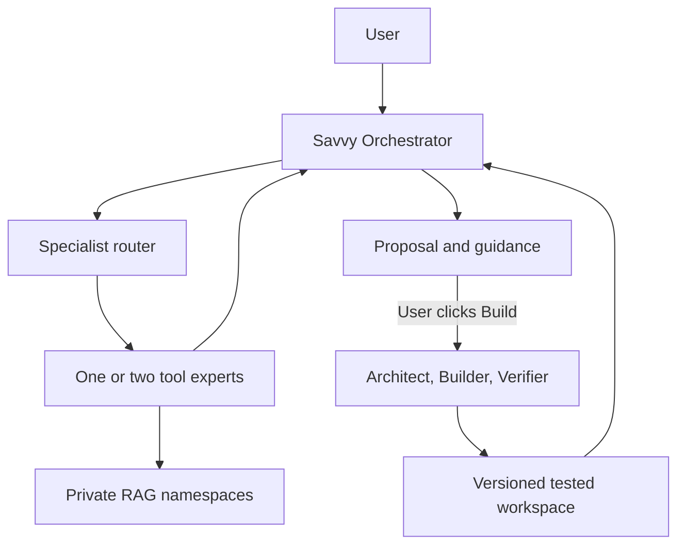

# Savvy Intelligence Architecture and Roadmap

## Outcome

Savvy Suite v0.7 gives the user one conversation with the Savvy Orchestrator. The Orchestrator
selects no more than two of the 16 tool-specific expert agents, retrieves evidence from each
expert's private knowledge namespace, combines their recommendations, and offers a versioned
build proposal. The user can request changes in the same conversation until the result is right.

## Technical architecture

| Layer | Implementation | Boundary |
|---|---|---|
| User interface | Loopback-only Command Center at `127.0.0.1:8787` | One Orchestrator chat; actions require the dashboard token and a user click |
| Orchestration | Persistent SQLite conversations, structured model routing, specialist consultation, final synthesis | At most two registered specialists; never invents tool IDs |
| Specialist agents | One generated expert definition per curated tool | Read-only knowledge, source, and health permissions; proposals go to versioned builds |
| RAG | `nomic-embed-text`, SQLite vectors, FTS5 lexical search, hybrid ranking, line citations | Per-tool namespaces; secrets, archives, environments, generated files, and Mac Cleanup Tools excluded |
| MCP | Stable Python MCP server over local stdio with six capabilities | Read-only inspection; `prepare_tool_launch` cannot execute a tool |
| Models | Ollama discovery across Mac and NUC; capability-based routing | Free local models; no paid provider required |
| Build factory | Architect → Builder → independent Verifier → deterministic tests → SHA-256 manifest | Writes only to isolated run workspaces; command and path allowlists |
| State | SQLite databases for runs, conversations, knowledge, and MCP audit hashes | Local files under `state/`; tool arguments are hashed in the MCP audit |

## Model routes on Joe's current hardware

| Work | Model | Computer |
|---|---|---|
| Fast routing | `llama3.2:3b` | Mac |
| Coding and standard work | `qwen2.5-coder:32b` | Mac |
| Deep reasoning and synthesis | `deepseek-r1:32b` | NUC |
| Vision | `llama3.2-vision:latest` | Mac |
| Embeddings | `nomic-embed-text` | Mac |

The router still discovers available models at runtime, so a temporarily unavailable computer
does not hard-code the suite to a dead endpoint.

## Milestone roadmap

### Milestone 1 — Factory foundation: complete

- Typed agent, project, workflow, and tool specifications.
- Isolated build workspaces, safe writes, deterministic tests, manifests, and resumable SQLite runs.
- Mac and NUC Ollama discovery with capability-based routing.

### Milestone 2 — Unified tool deck: complete

- 16 curated tools in one control root with categorized launchers.
- 15 prepared tools and guarded, folder-only Mac Cleanup Tools.
- Local Command Center, background queue, run history, and workspace opening.

### Milestone 3 — Savvy Intelligence: complete in v0.7

- Sole user-facing Orchestrator with persistent revision conversations.
- One expert agent per tool and a central specialist registry.
- Local, source-cited, incremental RAG using `nomic-embed-text`.
- Read-only MCP stdio server and generated client connection file.
- Specialist guidance, ideas, acceptance criteria, and explicit Build approval.
- Build results written back to the conversation for the next revision.

### Milestone 4 — Next best move

- Add a version comparison screen for two generated outcomes.
- Add per-tool health checks that experts can run without launching the tool.
- Add opt-in MCP write capabilities one at a time, each with a policy and explicit approval.
- Add a nightly incremental knowledge refresh after the first full index proves stable.
- Add evaluation fixtures for the most important real requests for each tool expert.

## First coding tasks completed in this release

1. Build the specialist registry from the curated 16-tool registry.
2. Implement the local embedding client, incremental indexer, hybrid search, and citations.
3. Implement the permission-enforcing MCP gateway and stable stdio server.
4. Implement persistent Orchestrator routing, specialist consultation, synthesis, and revision memory.
5. Pass specialist context and acceptance criteria into the existing build factory.
6. Extend the Command Center with chat, delegation evidence, proposals, RAG status, and MCP status.
7. Add the one-click installer, security tests, protocol handshake test, and packaging checks.

## Definition of done

- The user talks only to Savvy.
- All 16 curated tools have registered specialist agents.
- Retrieval results include real tool, file, and line citations.
- Secret-named files and guarded cleanup code are not indexed.
- MCP can inspect but cannot launch or modify a tool.
- A build begins only after the user clicks **Build this**.
- Generated output is isolated, tested, recorded, and available for revision in the same conversation.
